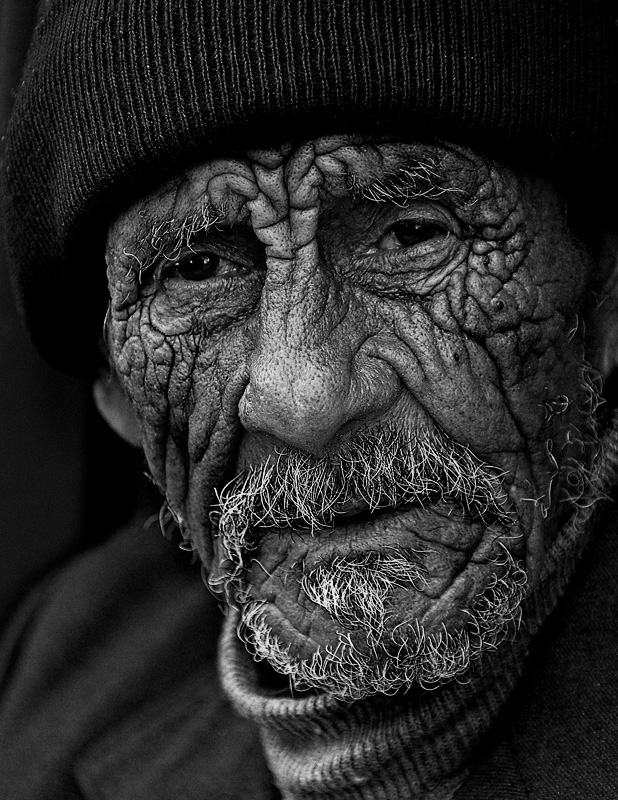
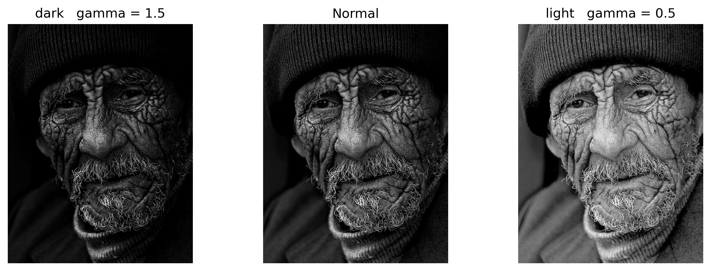

# Mini Image Processing Projects

This repository contains several mini-projects related to **image processing** using OpenCV and NumPy. Each project demonstrates different image processing techniques and their applications.

## 📂 Project Structure
```
📁 images/                # Folder containing sample images
📄 1.ipynb - 11.ipynb     # Jupyter notebooks for different projects
🖼 image_brighter.jpg     # Example of brightness adjustment
🖼 image_darker.jpg       # Example of darkening an image
🖼 laplacian_box_blur.jpg # Example of Laplacian with box blur
🖼 output_hist2.png       # Histogram equalization results
```

## 🚀 Implemented Techniques
- **Fourier Transform (FFT)** for frequency domain analysis
- **Histogram Equalization** for contrast enhancement
- **Laplacian Filters** for edge detection
- **Blurring Techniques** (Gaussian, Box Blur, etc.)
- **Brightness & Contrast Adjustments**

## 🔧 How to Use
1. Clone this repository:
   ```bash
   git clone https://github.com/yourusername/image-processing-mini-projects.git
   cd image-processing-mini-projects
   ```
2. Install dependencies:
   ```bash
   pip install opencv-python numpy matplotlib
   ```
3. Open Jupyter Notebook:
   ```bash
   jupyter notebook
   ```
4. Explore the notebooks (`.ipynb` files) and run them!

## 📷 Sample Results
Here are some processed images generated by these projects:
| Original | Processed |
|----------|----------|
|  |  |

## ✨ Contributing
Feel free to fork this repository and add more image processing techniques!

## 📜 License
This project is open-source and available under the MIT License.

